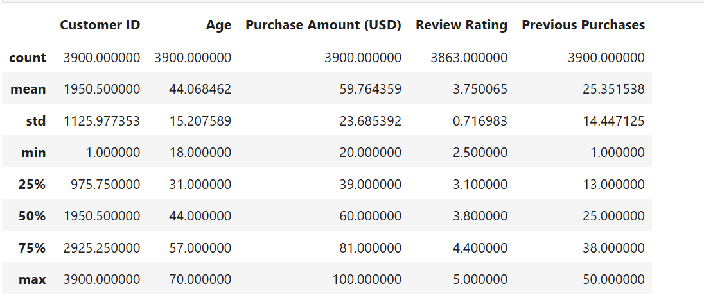

# 🛒 Customer Behavior Analysis

## 📘 Project Overview
This project explores and analyzes a **retail customer shopping behavior dataset** to help a company better understand how customers interact with its **products, discounts, and subscription programs**.  

The goal is to identify customer segments, purchasing trends, and factors that influence spending and subscription behavior — supporting data-driven decisions in marketing and customer retention.

---

## 🧩 Dataset Exploration

- **Rows:** 3,900  
- **Columns:** 18  

### 🗂️ Categorical Columns
`gender`, `item_purchased`, `category`, `location`, `size`, `color`, `season`,  
`subscription_status`, `discount_applied`, `payment_method`, `frequency_of_purchases`, `age_group`

### 🔢 Numerical Columns
`customer_id`, `purchase_amount`, `review_rating`, `previous_purchases`, `purchase_frequency_days`

### ⚠️ Missing Values
- 37 missing values in the **Review Rating** column.

---

## 🧹 Data Preparation

### **1. Data Loading**
- Loaded the dataset (`customer_shopping_behavior.csv`) in **Python** using the `pandas` library.  
- Used `.info()` and `.describe()` to explore summary statistics and data types.

### **2. Data Cleaning**
- **Missing values:** Replaced nulls in `Review Rating` with the median per product category.  
- **Column renaming:** Replaced spaces with underscores (`_`) for easier handling.  
- **Column removal:** Dropped `promo_code_used` since it duplicated `discount_applied`.  
- **Feature engineering:** Added:
  - `age_group` → categorized customer ages.  
  - `purchase_frequency_days` → derived from purchase date information.

---

## 💾 Database Upload

### **Connecting Python to SQL Server (SSMS)**
The cleaned dataset was uploaded from Python to **Microsoft SQL Server (SSMS)** using **SQLAlchemy** and Windows Authentication:

```python
from sqlalchemy import create_engine
from urllib.parse import quote_plus

driver = quote_plus("ODBC Driver 17 for SQL Server")
host = "localhost\\LOCALSQLL"
database = "customer_behavior"

connection_string = f"mssql+pyodbc://@{host}/{database}?driver={driver}&trusted_connection=yes"
engine = create_engine(connection_string)

df.to_sql("customer", engine, if_exists="replace", index=False).


```
## 🧠 Data Analysis using SQL in SSMS

A series of SQL queries were performed to uncover meaningful insights from customer behavior.

### **1. Revenue by Gender**
Total revenue generated by both male and female customers.

### **2. High-Spending Discounted**
Customers who surpassed the average purchase amount despite using discounts — highlighting loyal yet price-sensitive buyers.

### **3. Top 5 Rated Products**
Products with the highest review ratings, indicating customer satisfaction and potential best-sellers.

### **4. Shipping Comparison**
Comparison of average purchase amounts between **Standard** and **Express** shipping — showing spending differences by delivery preference.

### **5. Subscription Spending**
Analysis of total customers, average spending, and total revenue between **subscribed** and **non-subscribed** customers.

### **6. Discount Percentage**
Top 5 products with the highest percentage of purchases made with discounts — useful for understanding promotion sensitivity.

### **7. Customer Segmentation**
Customer segmentation based on their number of previous purchases — classified as **New**, **Returning**, and **Loyal** customers.

### **8. Top Products**
Top 3 products in each category based on the total number of purchases — identifying key revenue drivers by category.

### **9. Repeat Subscribers**
Insight into repeat buyers and their subscription behavior — revealing that most repeat buyers are still unsubscribed.

### **10. Revenue by Age Group**
Revenue contribution of each age group — **young adults** and **middle-aged customers** being the top contributors.

---

## 📊 Visualizations (Power BI Dashboard)

An interactive **Power BI dashboard** was created to visualize insights from the analysis




## 💡 Key Insights

- 🛍️ **Clothing and Accessories** are the most purchased categories.  
- 💸 **Young adults and middle-aged customers** are the main contributors to revenue.  
- 🔁 **Repeat buyers** are more likely to be subscribed customers.  
- 🚫 The **majority of the customer base remains unsubscribed**, indicating potential to expand the loyalty program.  

---


## 🧰 Tools & Technologies

| Tool | Purpose |
|------|----------|
| **Python (Pandas, SQLAlchemy)** | Data loading, cleaning, and database connection |
| **Microsoft SQL Server (SSMS)** | Data analysis and querying |
| **Power BI** | Dashboard and visualization |
| **GitHub** | Project documentation and sharing |

